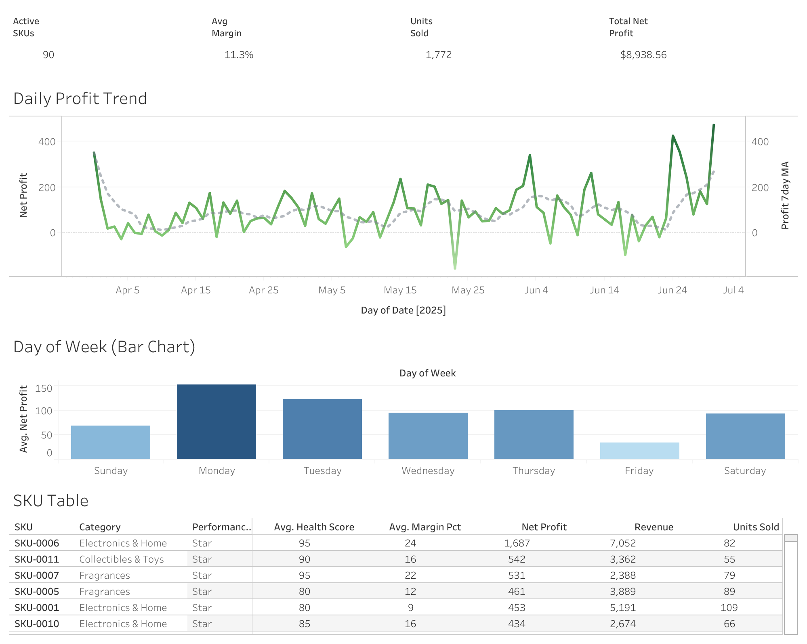

# Q2 2025 E-Commerce SKU Profitability & Velocity Analysis

An end-to-end business intelligence project analyzing quarterly performance for an Amazon e-commerce business. This project demonstrates data cleaning, transformation, SQL analysis, and interactive dashboard creation using real business data.



**[View Live Dashboard on Tableau Public →](https://public.tableau.com/app/profile/franklin.le3494/viz/Q22025SKUProfitabilityVelocityAnalysis/Dashboard)**

---

## 📊 Project Overview

### Business Problem

As an Amazon seller managing 90+ active SKUs across multiple product categories, I needed answers to critical business questions:

- Which products are actually profitable after all fees?
- What's driving daily/weekly profit fluctuations?
- Which SKUs should I restock vs. liquidate?
- How do different product categories compare?
- Are there patterns in when sales perform best?

Existing tools (Sellerboard, Amazon Seller Central) provide raw data but lack the consolidated, actionable view needed for strategic decision-making.

### Solution

Built a comprehensive analytics pipeline that:
1. Extracts and cleans data from Sellerboard exports
2. Transforms raw data with business logic (health scoring, categorization)
3. Analyzes patterns using SQL
4. Visualizes insights in an interactive Tableau dashboard

---

## 🗂️ Repository Structure

```
├── README.md
├── data/
│   ├── tableau_sku_data.csv        # Cleaned SKU-level dataset (90 products)
│   └── tableau_daily_data.csv      # Cleaned daily metrics (92 days)
├── sql/
│   └── analysis_queries.sql        # 8 analytical SQL queries
├── scripts/
│   └── data_transformation.py      # Python cleaning & transformation code
└── docs/
    ├── dashboard_preview.png       # Dashboard screenshot
    └── methodology.md              # Detailed methodology documentation
```

---

## 📈 Key Metrics & KPIs

| Metric | Q2 2025 Value | Insight |
|--------|---------------|---------|
| Total Net Profit | $8,939 | Bottom-line quarterly performance |
| Active SKUs | 90 | Portfolio breadth across 10 categories |
| Average Margin | 12.4% | After all Amazon fees and COGS |
| Units Sold | 1,772 | Total quarterly volume |
| Avg Daily Profit | $97.16 | Baseline for forecasting |

---

## 🔍 Key Insights

### 1. Category Concentration
**Electronics & Home drives 32% of total profit with only 11% of SKUs.** This category should be prioritized for restocking and expansion.

| Category | Profit | % of Total | SKU Count |
|----------|--------|------------|-----------|
| Electronics & Home | $2,843 | 31.8% | 10 |
| Other | $1,579 | 17.7% | 30 |
| Fragrances | $1,530 | 17.1% | 8 |
| Consumables & Health | $979 | 10.9% | 12 |

### 2. Portfolio Health Distribution
Using a custom health scoring algorithm, 52% of SKUs are performing well (Star + Strong tiers), while 18% need attention or liquidation.

| Tier | SKU Count | % of Portfolio | Action |
|------|-----------|----------------|--------|
| ⭐ Star | 19 | 21% | Scale up |
| Strong | 28 | 31% | Maintain |
| Average | 27 | 30% | Monitor |
| Weak | 16 | 18% | Review/Liquidate |

### 3. Day-of-Week Pattern
**Monday is 4.5x more profitable than Friday.** This insight can inform inventory management and promotional timing.

| Day | Avg Profit |
|-----|------------|
| Monday | $152.31 |
| Tuesday | $123.07 |
| Wednesday | $94.10 |
| Thursday | $99.34 |
| Friday | $33.85 |
| Saturday | $93.46 |
| Sunday | $69.22 |

### 4. Refund Risk
15 SKUs have refund rates >15%, indicating potential quality issues requiring investigation.

---

## 🛠️ Methodology

### Data Pipeline

```
┌─────────────────┐     ┌─────────────────┐     ┌─────────────────┐     ┌─────────────────┐
│   Sellerboard   │────▶│  Python/Pandas  │────▶│     SQLite      │────▶│     Tableau     │
│   CSV Exports   │     │   Cleaning &    │     │    Analysis     │     │    Dashboard    │
│                 │     │  Transformation │     │                 │     │                 │
└─────────────────┘     └─────────────────┘     └─────────────────┘     └─────────────────┘
```

### Data Cleaning Challenges

1. **European Number Formatting**: Converted `5 191,16` → `5191.16` (space as thousands separator, comma as decimal)
2. **Product Name Parsing**: Stripped embedded COG/Price metadata from product names
3. **Category Assignment**: Built keyword-based classification for 10 product categories
4. **Data Anonymization**: Replaced actual SKUs with anonymous IDs for portfolio sharing

### Health Score Algorithm

Developed a composite scoring system (0-100 scale) evaluating four performance dimensions:

```python
def calculate_health_score(row):
    score = 50  # Base score
    
    # Profit contribution (max +20 / min -15)
    if row['Net_Profit'] > 500: score += 20
    elif row['Net_Profit'] > 200: score += 15
    elif row['Net_Profit'] > 100: score += 10
    elif row['Net_Profit'] > 50: score += 5
    elif row['Net_Profit'] < 0: score -= 15
    
    # Velocity (max +15 / min -10)
    if row['Units'] > 50: score += 15
    elif row['Units'] > 25: score += 10
    elif row['Units'] > 10: score += 5
    elif row['Units'] == 0: score -= 10
    
    # ROI (max +10 / min -10)
    if row['ROI'] > 50: score += 10
    elif row['ROI'] > 25: score += 5
    elif row['ROI'] < 0: score -= 10
    
    # Margin (max +5 / min -5)
    if row['Margin'] > 20: score += 5
    elif row['Margin'] < 5: score -= 5
    
    return max(0, min(100, score))
```

---

## 🔬 SQL Analysis

The project includes 8 analytical queries demonstrating:

| Query | Skills Demonstrated |
|-------|---------------------|
| Top SKUs by Profit | `ORDER BY`, `LIMIT`, filtering |
| Category Performance | `GROUP BY`, aggregation, `RANK()` window function |
| Daily Running Total | `SUM() OVER`, rolling averages |
| Week-over-Week Comparison | CTEs, `LAG()` window function |
| SKUs Needing Attention | Complex `WHERE`, `CASE` statements |
| Refund Rate Outliers | Subqueries, statistical thresholds |
| Day of Week Pattern | Categorical grouping, custom sorting |
| Tier Distribution | Window functions for percentage calculations |

**Example: Week-over-Week Analysis**
```sql
WITH weekly_stats AS (
    SELECT 
        Week_Number,
        MIN(Date) as Week_Start,
        SUM(Net_Profit) as Weekly_Profit
    FROM daily_metrics
    GROUP BY Week_Number
)
SELECT 
    Week_Number,
    Weekly_Profit,
    LAG(Weekly_Profit) OVER (ORDER BY Week_Number) as Prev_Week,
    ROUND((Weekly_Profit - LAG(Weekly_Profit) OVER (ORDER BY Week_Number)) * 100.0 
          / NULLIF(LAG(Weekly_Profit) OVER (ORDER BY Week_Number), 0), 1) as Change_Pct
FROM weekly_stats;
```

[View all queries →](sql/analysis_queries.sql)

---

## 📊 Dashboard Components

| Component | Chart Type | Purpose |
|-----------|------------|---------|
| KPI Cards | Big Numbers | High-level performance snapshot |
| Profit by Category | Horizontal Bar | Identify top-performing categories |
| Health Distribution | Bar Chart | Portfolio quality assessment |
| Daily Profit Trend | Line + Area | Visualize Q2 trajectory with 7-day MA |
| SKU Performance Table | Table | Drill-down to individual products |
| Day of Week Analysis | Bar Chart | Identify timing patterns |

**Interactivity:**
- Click category to filter entire dashboard
- Hover for detailed tooltips
- Sortable table columns

---

## 🧰 Tools & Technologies

| Tool | Purpose |
|------|---------|
| Python (pandas, numpy) | Data cleaning & transformation |
| SQLite | Data storage & analysis |
| Tableau Public | Dashboard visualization |
| Git/GitHub | Version control & documentation |

---

## 📁 Data Dictionary

### tableau_sku_data.csv

| Column | Type | Description |
|--------|------|-------------|
| SKU | string | Anonymized product identifier |
| Category | string | Product category (10 categories) |
| Units_Sold | int | Total units sold in Q2 |
| Refunds | int | Number of refunds |
| Revenue | float | Total sales revenue |
| COGS | float | Cost of goods sold |
| Amazon_Fees | float | All Amazon fees (commission, FBA, etc.) |
| Gross_Profit | float | Revenue - Amazon Fees |
| Net_Profit | float | Revenue - COGS - Amazon Fees |
| Margin_Pct | float | Net Profit / Revenue × 100 |
| ROI_Pct | float | Net Profit / COGS × 100 |
| Health_Score | int | Custom 0-100 performance score |
| Performance_Tier | string | Star/Strong/Average/Weak |
| Refund_Rate_Pct | float | Refunds / Units Sold × 100 |
| Avg_Sale_Price | float | Revenue / Units Sold |
| Profit_Per_Unit | float | Net Profit / Units Sold |
| Sessions | int | Product page sessions |

### tableau_daily_data.csv

| Column | Type | Description |
|--------|------|-------------|
| Date | date | Transaction date |
| Revenue | float | Daily sales |
| Units_Sold | int | Daily units |
| Orders | int | Number of orders |
| Refunds | int | Number of refunds |
| Amazon_Commission | float | Amazon referral fees |
| FBA_Fees | float | Fulfillment by Amazon fees |
| COGS | float | Cost of goods sold |
| Gross_Profit | float | Revenue - Amazon fees |
| Net_Profit | float | Daily profit |
| Margin_Pct | float | Daily margin percentage |
| Sessions | int | Daily traffic sessions |
| Profit_7day_MA | float | 7-day profit moving average |
| Units_7day_MA | float | 7-day units moving average |
| Revenue_7day_MA | float | 7-day revenue moving average |
| Day_of_Week | string | Monday-Sunday |
| Week_Number | int | ISO week number |
| Conversion_Rate_Pct | float | Orders / Sessions × 100 |

---

## 🚀 How to Use This Repository

1. **View the Dashboard**: [Tableau Public Link](https://public.tableau.com/app/profile/franklin.le3494/viz/Q22025SKUProfitabilityVelocityAnalysis/Dashboard)

2. **Explore the Data**:
   ```bash
   git clone https://github.com/YOUR_USERNAME/q2-ecommerce-analytics.git
   cd q2-ecommerce-analytics
   ```

3. **Run SQL Queries**:
   ```bash
   sqlite3 data/ecommerce_analytics.db < sql/analysis_queries.sql
   ```

4. **Reproduce the Analysis**:
   ```bash
   pip install pandas numpy
   python scripts/data_transformation.py
   ```

---

## 📝 Future Enhancements

- [ ] Add inventory optimization analysis (reorder points, stockout costs)
- [ ] Build predictive model for daily profit forecasting
- [ ] Create automated data refresh pipeline
- [ ] Expand to multi-quarter comparison

---

## 👤 Author

**Your Name**
- LinkedIn: [your-linkedin](https://www.linkedin.com/in/franklinle/)
- Tableau Public: [your-profile](https://public.tableau.com/app/profile/franklin.le3494/vizzes)
- GitHub: [@your-username](https://github.com/franklinle)

---

## 📄 License

This project is for portfolio/educational purposes. Data has been anonymized to protect business information.
